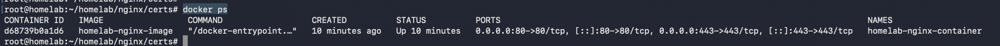
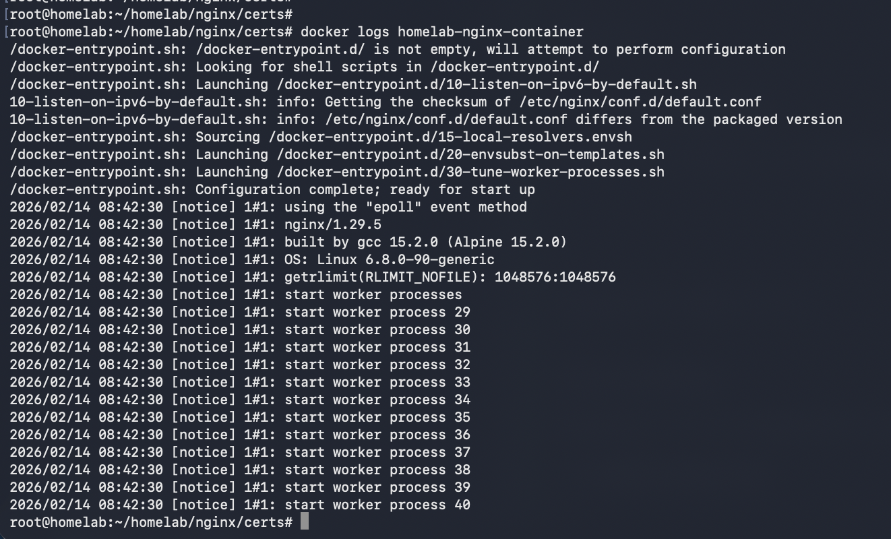
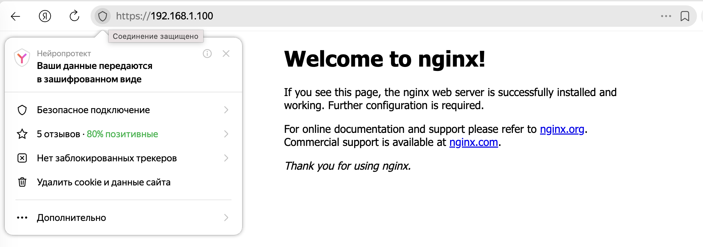
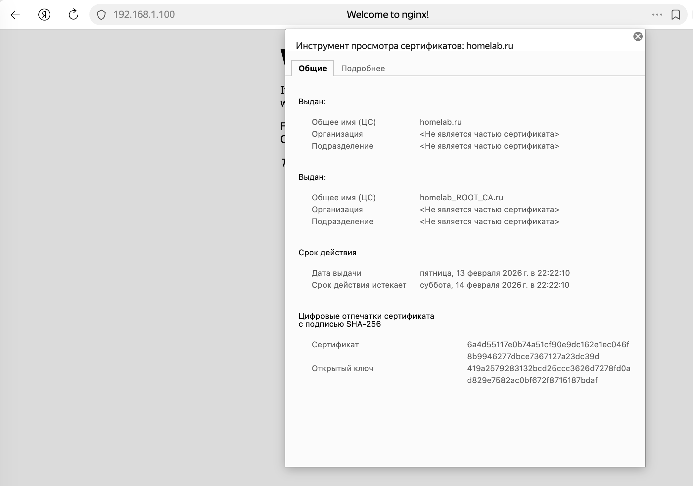

# Self-signed-certificate + NGINX
Лабораторная для понимания принципа работы самоподписанных сертификатов. Имитируем корневой центр сертификации, подписываем им сертификат и тестируем на NGINX


---

# Мимикрия под CA
Первым делом создаем приватный ключ и сертификат, которые будут имитировать CA:

```
openssl req `# создать новый сертификат/ключ` \
  -subj '/CN=homelab_ROOT_CA/CN=homelab_ROOT_CA.ru' `# FQDN субъекта` \
  -x509 -sha256 `# создать сертификат, а не запрос на подпись сертификата` \
  -days 3653 `# на 10 лет` \
  -newkey rsa:2048 `# сгенерировать новый ключ размером 2048 бит с алгоритмом RSA` \
  -keyout homelab_ROOT_CA.key `# файл для сохранения ключа` \
  -out homelab_ROOT_CA.crt # файл для сохранения сертификата
```
  

В процессе создания OpenSSL спросит пароль для создаваемого ключа. Его нужно запомнить. Во время подписания сертификата для сервиса нужно будет указать passphrase корневого сертификата.

# Сертификат для сервиса
Первым делом необходимо создать ключ для сервиса:

```
openssl genrsa `# сгенерировать ключ с алгоритмом RSA` \
  -out homelab.key `# файл для сохранения ключа` \
  2048 # размер ключа в битах
```

И запрос на подпись сертификата:

```
openssl req `# запрос подписи сертификата` \
  -new `# новый запрос` \
  -subj 'CN=homelab/CN=homelab.ru' `# FQDN субъекта` \
  -key homelab.key `# файл ключа` \
  -out homelab.csr `# файл для запроса`
```

Теперь нужно подписать запрос на создание сертификата при помощи CA-сертификата и ключа. Но перед этим нужно создать файл с расширениями сертификата, которые будут добавлены при подписании - localhost.ext. В расширениях нужно указать, что полученный сертификат не является CA-сертификатом и не может использоваться для подписания других сертификатов, а так же альтернативные имена субъекта.

Содержание файла с расширениями сертификата req.ext:

```
    authorityKeyIdentifier=keyid,issuer
    basicConstraints=CA:FALSE
    subjectAltName=@alt_names
    [alt_names]
    DNS.1=localhost
    IP.1=127.0.0.1
    IP.1=192.168.1.100 `# Мой айпишник домашнего сервера, на котором поднимал NGINX и выпускал серты`
```

Подписываем сертификат сервиса коренвым сертификатом:

```
openssl x509 -req `# Подпись сертификата` \
  -CA homelab_ROOT_CA.crt `# Сертификат CA` \
  -CAkey homelab_ROOT_CA.key `# Ключ CA` \
  -in homelab.csr `# Запрос на подпись` \
  -out homelab.crt `# Файл для полученного сертификата` \
  -days 1 `# на 1 день` \
  -CAcreateserial`# сгенерировать идентификатор` \
  -extfile req.ext # файл с расширениями
```

Для удобства импорта сертификатов homelab_ROOT_CA.crt и homelab.crt их можно объединить в цепочку сертификатов следующим образом:

```
cat homelab.crt homelab_ROOT_CA.crt > localhost_full.crt
```

На этом этапе у нас есть всё необходимое для использования SSL в сервисах вроде NGINX или Apache httpd

# Установка созданного сертификата

Устанавливаем к себе подписанный сертификат homelab.crt и перезагружаем браузер

# Проверка созданных сертификатов

Клонируем этот репозиторий и кладем в папку certs созданные сертификаты для приложения:

homelab.crt  
homelab.key

Собираем образ из Dockerfile и задаём ему имя "homelab-nginx-image":

```
docker build -t homelab-nginx-image .
```

Запускаем созданный образ, прокидываем порты и задаём имя контейнеру:

```
docker run -d -p 80:80 -p 443:443 --name homelab-nginx-container homelab-nginx-image
```

Убеждаемся, что контейнер запустился: 
```
docker ps
```



Проверяем по логам, что в контейнере нет ошибок:

```
docker logs homelab-nginx-container
```



Переходим по адресу хоста:

```
http://localhost/
```
Проверяем, что нас редиректнуло на 443 порт и в адресной строке появился замочек.



Проверяем по какому сертификату мы подключились и кем он подписан:

